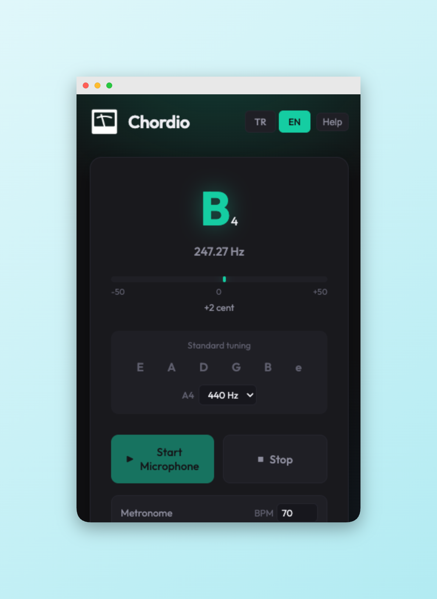

# Chordio

Chordio is a lightweight desktop **tuner + metronome** app designed for quick practice sessions.

DMG: https://drive.google.com/file/d/1Sl76fmhbaDkh4sPDCglfHRVznBH0qKJS/view?usp=sharing

## Features

- **Real-time tuning via microphone**
  - Shows detected **note**, **octave** and **frequency (Hz)**
  - Visual **cents meter** with in-tune / flat / sharp feedback
  - Holds the last stable reading briefly to reduce flicker in quiet moments

- **Standard guitar tuning guide**
  - Built-in reference for **E2–A2–D3–G3–B3–E4**
  - Click any string label to play a **reference tone**

- **A4 calibration**
  - Adjustable reference pitch from **440 Hz to 444 Hz**

- **Metronome**
  - Start/stop metronome with a configurable **BPM (40–220)**
  - Accented downbeat for easy counting

- **Multi-language UI**
  - Toggle between **Turkish (TR)** and **English (EN)**

- **Help & guidance**
  - Built-in “How to tune” help modal

- **Keyboard shortcuts**
  - Press **Space** to start/stop listening (when not typing in an input)
  - Global shortcut **Cmd/Ctrl + Shift + T** to bring the app to the front

- **Tray-friendly desktop behavior**
  - Runs in the system tray/menu bar for quick access
  - Closing the window hides the app instead of quitting

- **Mini mode**
  - Optional compact, always-on-top mode for minimal distraction

---

## Özellikler (TR)

- **Mikrofon ile gerçek zamanlı akort**
  - Algılanan **nota**, **oktav** ve **frekans (Hz)** bilgilerini gösterir
  - Akort durumunu **cents göstergesi** ile (akortlu / pes / tiz) görselleştirir
  - Sessiz anlarda ekrandaki değerlerin titremesini azaltmak için son stabil sonucu kısa süre korur

- **Standart gitar akort rehberi**
  - **E2–A2–D3–G3–B3–E4** için yerleşik referans
  - Tel etiketlerine tıklayarak **referans sesi** çalabilirsiniz

- **A4 kalibrasyonu**
  - Referans perdeyi **440 Hz – 444 Hz** aralığında ayarlayabilirsiniz

- **Metronom**
  - Ayarlanabilir **BPM (40–220)** ile metronomu başlat/durdur
  - Takibi kolaylaştırmak için vurgulu ilk vuruş

- **Çok dilli arayüz**
  - **Türkçe (TR)** ve **İngilizce (EN)** arasında geçiş

- **Yardım & yönlendirme**
  - Akort yapmayı anlatan yerleşik yardım ekranı

- **Klavye kısayolları**
  - **Space** ile dinlemeyi başlat/durdur (bir input alanına yazmıyorken)
  - Uygulamayı öne getirmek için global kısayol: **Cmd/Ctrl + Shift + T**

- **Tepsi/menü çubuğu odaklı kullanım**
  - Hızlı erişim için sistem tepsisi/menü çubuğunda çalışır
  - Pencereyi kapatınca uygulama kapanmak yerine gizlenir

- **Mini mod**
  - Daha az dikkat dağıtması için kompakt, her zaman üstte (always-on-top) mod
